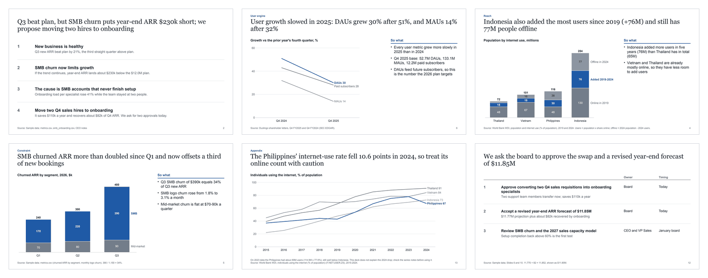
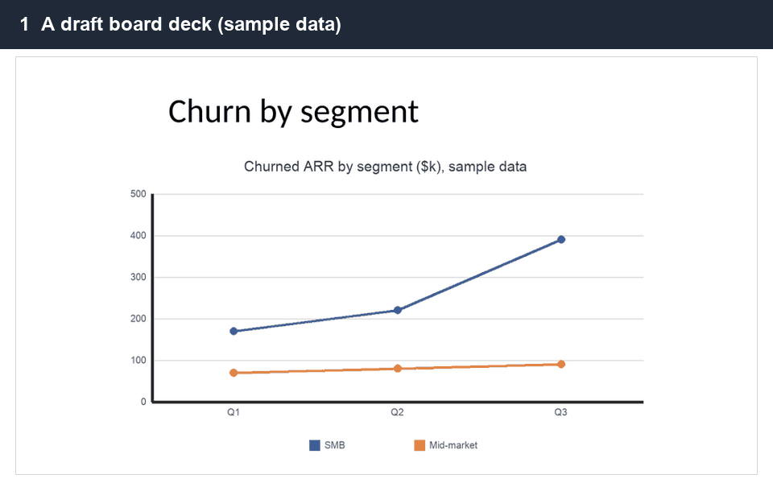
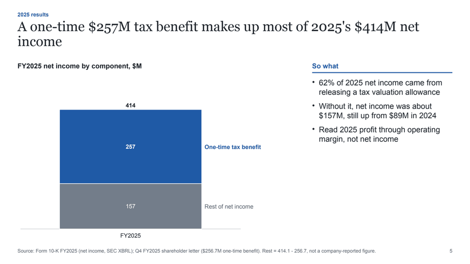
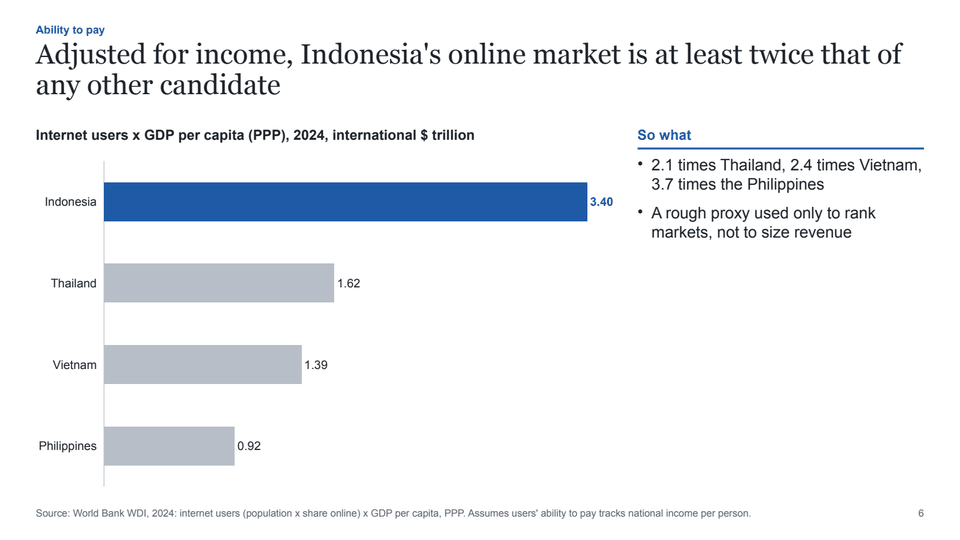
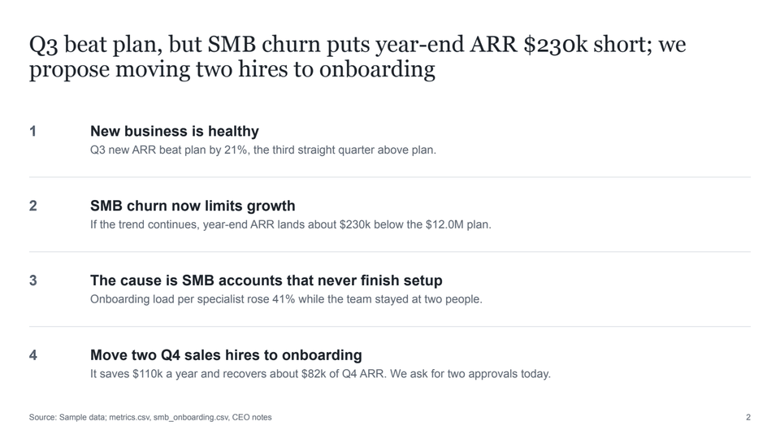
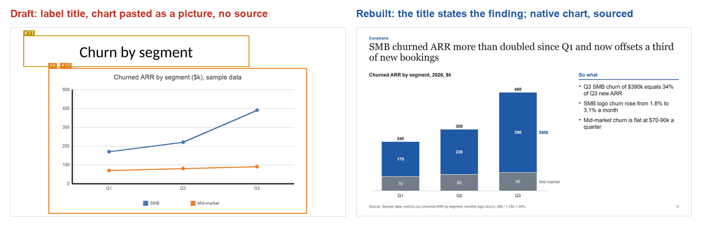

# SoWhat Decks

Answer-first, editable PowerPoint decks from your coding agent.

Give your agent your notes and data. It plans the storyline, builds a .pptx on your own template with native charts, and reviews the deck before anyone else sees it.

Free and open source (MIT). [Pro](#pro) adds advanced exhibits and deck recipes.

## Read only the titles

Two versions of one Q3 board update, built from the same sample data. The draft on the left titles each slide with a topic label; the deck on the right was rebuilt with SoWhat Decks. Both are in [`examples/03-review-before-after`](examples/03-review-before-after/).

| Draft | Rebuilt with SoWhat Decks |
|---|---|
| Executive summary | Q3 beat plan, but SMB churn puts year-end ARR $230k short; we propose moving two hires to onboarding |
| Q3 ARR bridge | Ending ARR of $11.05M beat plan by 1.4%, a smaller margin than new ARR because churn rose |
| Churn by segment | SMB churned ARR more than doubled since Q1 and now offsets a third of new bookings |
| Onboarding capacity | Setup completion fell from 68% to 55% as new accounts per specialist rose 41% |
| Next steps | We ask the board to approve the swap and a revised year-end forecast of $11.85M |

Skim the right-hand column and you know what happened, why, and what the board is asked to decide. The title check in `deck-storyline` flags 8 of the draft's 14 titles as errors and 3 more as warnings ([output](examples/storyline-tests/control-topic-titles/title-lint.txt)).

## Try it

After you install (below), paste one of these into your agent:

> Use deck-review on ./my-deck.pptx. Give me the five fixes that matter most.

> Use deck-storyline to plan a 10-slide board update from ./notes.md and ./metrics.csv. The decision we need: approve the Q4 hiring plan. Then build it with deck-build.

## Install

**Claude Code plugin**

    /plugin marketplace add WQGGSEY/sowhat-decks
    /plugin install sowhat-decks@sowhat-decks

**skills CLI**

    npx skills add WQGGSEY/sowhat-decks

**Claude apps (claude.ai):** download a skill ZIP from the [latest release](https://github.com/WQGGSEY/sowhat-decks/releases/latest). Each release has one ZIP per skill and one with all four. In Claude, open Customize > Skills, click +, choose Create skill, then Upload a skill, and upload one skill ZIP at a time. Code execution must be turned on. We haven't tested this route yet.

**Manual:** copy the folders in `skills/` to `~/.claude/skills/`.

Needs Python 3.9 or newer and python-pptx. LibreOffice and pypdfium2 are optional. With them, deck-build exports PDF and PNG previews and deck-review checks the rendered slides; deck-review's annotated images also need Pillow. The scripts never install anything.

Tested in Claude Code on macOS. Other agents and the Claude apps aren't tested yet (see [Limits](#limits)).

## How it works

| Skill | What it does | You get |
|---|---|---|
| `deck-storyline` | Turns your purpose, audience, decision and material into one governing message, SCQA, and a full-sentence title for every slide with the evidence it needs. Marks gaps as `[DATA NEEDED]` and runs a title-only test. | `storyline.md`, a title-only ghost deck |
| `deck-build` | Builds the deck on your .pptx or .potx template: 12 layouts, source lines, page numbers, speaker notes, and fonts for English, Korean and Japanese. | `deck.pptx`, `deck.pdf`, slide PNGs |
| `deck-exhibits` | Picks the exhibit from the message and draws it as a native chart or shapes: bar, line, stacked bar, highlight table, 2×2 matrix, process chevrons. | Charts with their data inside the file |
| `deck-review` | Renders a .pptx from any tool, checks titles, font sizes, overflow, off-slide shapes, charts pasted as pictures and missing sources, then scores each slide against a rubric. Its automatic fixes never change words or numbers. | `review.md`, annotated PNGs, `deck.fixed.pptx` |

The skills tell your agent to use only numbers from your material or a cited source. If the material doesn't support a claim, the slide says `[DATA NEEDED]` and the review flags it; the ghost decks in [`examples/storyline-tests`](examples/storyline-tests/) show both steps. Check the numbers before you send the deck.

## Examples

Each folder has the brief, the inputs, the storyline, the deck spec, the deck (.pptx and PDF), slide PNGs, the review and the sources, plus a README with the prompts and commands that rebuild it. The final decks have no high or medium automatic deck-review findings; `tests/test_examples.py` checks that on every change.

| | Example | Built from | Open |
|---|---|---|---|
|  | **Investor update**, 13 slides | A public company's FY2025 10-K and two shareholder letters, every number cited | [PDF](examples/01-investor-update/deck.pdf) · [PPTX](examples/01-investor-update/deck.pptx) · [storyline](examples/01-investor-update/storyline.md) · [review](examples/01-investor-update/review.md) |
|  | **Which Southeast Asian market first?** 13 slides | World Bank indicators, cited. The company is hypothetical | [PDF](examples/02-market-entry/deck.pdf) · [PPTX](examples/02-market-entry/deck.pptx) · [storyline](examples/02-market-entry/storyline.md) · [review](examples/02-market-entry/review.md) |
|  | **Board update, reviewed and rebuilt**, 14 slides | Sample data, labelled on every slide. Includes a draft with planted problems and its review | [review of the draft](examples/03-review-before-after/review.md) · [draft PDF](examples/03-review-before-after/before-review/render/before.pdf) · [rebuilt PDF](examples/03-review-before-after/deck.pdf) · [prompts](examples/03-review-before-after/README.md#prompts-and-commands) |

## Review any deck

`deck-review` works on a .pptx from any tool or person. It renders the slides, lists what a careful reviewer would catch, and rewrites weak titles as claims. On the draft board deck in example 03 it found 1 high, 18 medium and 11 low issues: label titles, three charts pasted as pictures, text below 12 pt, exhibits without a source, and a forecast left as "TBD".

## Free vs Pro

| | Free (MIT) | Pro ($29 one-time) |
|---|---|---|
| Skills | deck-storyline, deck-build, deck-exhibits, deck-review | All four, plus exhibits-pro, deck-recipes, brand-fit |
| Storyline (governing message, SCQA, action titles, title-only test) | ✓ | ✓ |
| Layouts | 12 core layouts | 12 core layouts, plus slide plans for 10 deck types |
| Your template | Uses your template's layouts and placeholders | Adds a brand map for complex templates and moves old decks onto a new one |
| Exhibits | 6: bar, line, stacked bar, highlight table, 2×2 matrix, process chevrons | 21: the 6, plus waterfall, Mekko chart, Gantt roadmap, Harvey-ball table, value driver tree, issue tree, tornado, funnel, change-arrow bars, quadrant scatter, heatmap table, RAG scorecard, org chart, RACI, benchmark dot plot |
| Review any .pptx | ✓ | ✓, plus brand checks |
| Examples | 3 decks, one with a review before and after | 10 more decks, one per recipe |
| Storyline worksheet (PDF) | | ✓ |
| Updates | This repo | Every v1.x release for 12 months |
| License | MIT | One person, unlimited decks |

## Pro

The free pack builds a complete deck. Pro is for the harder ones.

- **15 more exhibits**, all native and editable: waterfall, Mekko chart, Gantt roadmap, Harvey-ball table, value driver tree, issue tree, tornado, funnel, change-arrow bars, quadrant scatter, heatmap table, RAG scorecard, org chart, RACI, benchmark dot plot
- **10 deck recipes**, each with a finished example deck (.pptx and PDF): strategy recommendation, market entry, board review, fundraising, steering committee, business case, due diligence, product roadmap, post-mortem, client proposal
- **brand-fit**: map a complex company template and move old decks onto it
- A one-page storyline worksheet, and every v1.x update for 12 months

$29 one-time · 14-day refund · one person, unlimited decks

**[See what's in SoWhat Decks Pro](GUMROAD_URL)**

## Limits

- Rendering uses LibreOffice. Without it, deck-review runs the structural checks and skips the visual pass.
- PowerPoint can wrap text slightly differently from LibreOffice or Keynote. Open the final deck in PowerPoint before you send it.
- The free pack draws 6 exhibit types. Waterfalls, Mekko charts, trees and roadmaps are in Pro.
- Templates with many slide masters or unusual placeholders may need manual layout mapping in the free pack.
- deck-review reads .pptx files only. It can't open .ppt, .key or password-protected files, and it doesn't look inside SmartArt or embedded objects.
- deck-review's automatic checks can miss things. Its picture-of-a-chart check looks for dark axis lines, and its label-title check missed one of the 12 label titles in example 03. The title-only read in the rubric caught it.
- Google Slides: import the .pptx. The skills don't call the Google Slides API.
- Tested in Claude Code on macOS, with English and Korean decks. Japanese has a smoke test only. Other agents aren't tested yet.
- Claude apps and Claude for PowerPoint: each SKILL.md has a no-code mode designed for chat and Claude for PowerPoint, but we haven't tested it there yet.

## Privacy

The scripts run on your computer and make no network calls. Your agent sees whatever files you give it. LibreOffice can follow links embedded in a deck when it renders, so run deck-review with `--no-render` on decks from people you don't know.

## Development

    python3 -m pip install python-pptx pypdfium2 pytest
    python3 -m pytest -q

Render tests run only when LibreOffice is installed. `AGENTS.md` has the rules for changing the repository. `tools/build_skill_zips.py` builds the release ZIPs (the release workflow runs it on every `v*` tag), and `tools/make_readme_images.py` rebuilds the images in `docs/img/` from the example slides.

## License

MIT. Example decks use public data with sources, or data labelled as sample data. The investor-update example is an illustration built from public filings and is not affiliated with the company it describes. The examples were built during development by Claude Code agents following these skills; each example's README restates the prompts and lists the commands.

SoWhat Decks is an independent project, not affiliated with Anthropic or Microsoft.
