# Deck review: before.pptx

Automatic checks by deck-review on 2026-10-04: `python3 skills/deck-review/scripts/review.py run examples/03-review-before-after/before/before.pptx --out examples/03-review-before-after/before-review`. The script output is below unchanged; the re-ranked top 5, rewritten titles, story scores, so-what lines and rubric review were added by the agent with `skills/deck-review/references/rubric.md` after looking at every rendered slide. Image links point to `before-review/`.

- **Slides:** 14
- **Issues:** 1 high, 18 medium, 11 low
- **Mechanical score:** 7.5/10 (mean of slides; story score is the agent's)
- **Rendered:** `before-review/render/before.pdf`, 14 PNGs; problems boxed in `before-review/annotated/`
- **Fixed copy:** `before-review/before.fixed.pptx` with 15 safe fixes; 23 issues remain in it

## Top 5 fixes

1. **[high] Unfinished figures or sources** — slide 6 (#12). Fill in the real number and its source, or cut the claim that needs it.
2. **[medium] Text below the size floor** — slides 2, 4, 6, 7, 8, 10, 11, 12, 13, 14 (#1, #6, #13, #15, #16, #21, …). Body 12 pt, sources and tables 10 pt at least. *(fixed automatically in the fixed copy)*
3. **[medium] Exhibits without a source line** — slides 3, 4, 5, 9, 14 (#3, #7, #9, #18, #30). Add 'Source: ...' under each chart or table (10 pt or more). *(fixed automatically in the fixed copy)*
4. **[medium] Charts pasted as pictures** — slides 3, 5, 9 (#4, #10, #19). Rebuild them as native charts so the data stays editable.
5. **[low] Titles that may be topic labels (heuristic; confirm by reading)** — slides 2, 3, 4, 5, 6, 8, 9, 10, 11, 12, 13 (#2, #5, #8, #11, #14, #17, …). Rewrite each as one sentence that states what the slide proves (see Rewritten titles).

**Agent re-rank (rubric section 8).** The script found the mechanical problems; the bigger ones are in the argument:

1. **Storyline (slides 2, 10, 12).** No governing message and the ask is buried. Slide 2 lists six facts without saying what the board must decide; the proposal only appears on slide 10, without its cost or benefit; slide 12 ends on "Discuss the hiring plan". Put the answer and the two approvals on slide 2 and end on them with owners and dates.
2. **[high] Slide 6: "Year-end ARR forecast: TBD".** The board is asked to react to a churn problem without the number that shows its size. Compute the projection from the deck's own quarterly data with stated assumptions, or mark it `[DATA NEEDED: year-end ARR forecast, $k]`.
3. **Label titles on all 12 content slides (2-13).** The script flagged 11 and missed slide 7. Rewrite each as the claim its slide proves: see Rewritten titles.
4. **Charts pasted as pictures and no sources (slides 3, 4, 5, 9, 14).** Rebuild the three charts as native charts, add "Source: Sample data; metrics.csv" to every exhibit, and split slide 9, which puts a percentage and a count on one axis.
5. **Text below the floors on 10 slides.** `before.fixed.pptx` raises it to 12 pt (body) and 10 pt (tables) without changing words. Cut words where the larger size no longer fits.

## Title read-through

Read only the titles, top to bottom. Do they tell the whole story? The claim/label verdicts are rule-based guesses; the agent's reading is in the rubric review below.

| Slide | Title | Verdict |
|---|---|---|
| 1 | Q3 2026 board update | cover |
| 2 | Executive summary | **label?** (common topic label) |
| 3 | Bookings performance | **label?** (2 words, no verb) |
| 4 | Q3 ARR bridge | **label?** (3 words, no verb) |
| 5 | Churn by segment | **label?** (3 words, no verb) |
| 6 | Q4 outlook | **label?** (2 words, no verb) |
| 7 | Setup status of churned accounts | claim |
| 8 | Churn by setup status | **label?** (no verb found; reads like a topic) |
| 9 | Onboarding capacity | **label?** (2 words, no verb) |
| 10 | Proposal: hiring plan changes | **label?** (no verb found; reads like a topic) |
| 11 | Risks | **label?** (common topic label) |
| 12 | Next steps | **label?** (common topic label) |
| 13 | Cash runway | **label?** (2 words, no verb) |
| 14 | Q1-Q3 2026 metrics by quarter | claim |

As one paragraph: Q3 2026 board update. Executive summary. Bookings performance. Q3 ARR bridge. Churn by segment. Q4 outlook. Setup status of churned accounts. Churn by setup status. Onboarding capacity. Proposal: hiring plan changes. Risks. Next steps. Cash runway. Q1-Q3 2026 metrics by quarter.

## Rewritten titles

Proposed by the agent from the slide's own content. No number was added that the deck does not contain.

| Slide | Current | Proposed |
|---|---|---|
| 2 | Executive summary | Q3 beat plan, but rising SMB churn threatens the $12.0M year-end plan; we propose moving two Q4 hires to onboarding |
| 3 | Bookings performance | New ARR beat plan by 21% in Q3, the third straight quarter above plan |
| 4 | Q3 ARR bridge | Ending ARR of $11.05M beat plan by $150k, less than the $200k beat on new ARR, as churned ARR rose to $480k |
| 5 | Churn by segment | SMB churned ARR more than doubled since Q1 and now offsets a third of new bookings |
| 6 | Q4 outlook | Year-end ARR will miss the $12.0M plan unless SMB churn stops rising [DATA NEEDED: year-end ARR forecast, $k] |
| 8 | Churn by setup status | Accounts that finish setup churn at about a fifth of the rate of those that do not |
| 9 | Onboarding capacity | Setup completion fell from 68% to 55% as new accounts per specialist rose 41% |
| 10 | Proposal: hiring plan changes | Moving two of the four Q4 sales hires to onboarding saves about $110k a year |
| 11 | Risks | The main risk is slower sales capacity in 2027 [DATA NEEDED: 2027 new ARR with 2 vs 4 Q4 sales hires, $k] |
| 12 | Next steps | We ask the board to approve the swap and a revised year-end forecast [DATA NEEDED: revised forecast, $k] |
| 13 | Cash runway | Cash runway is about 22 months at the current $650k monthly burn |

## Slide by slide

| Slide | Title | Mechanical (0-10) | Story (0-10) | Issues |
|---|---|---|---|---|
| 1 | Q3 2026 board update | 10.0 | — | — |
| 2 | Executive summary | 8.0 | 2 | #1, #2 |
| 3 | Bookings performance | 6.5 | 3 | #3, #4, #5 |
| 4 | Q3 ARR bridge | 6.5 | 3 | #6, #7, #8 |
| 5 | Churn by segment | 6.5 | 3 | #9, #10, #11 |
| 6 | Q4 outlook | 5.0 | 1 | #12, #13, #14 |
| 7 | Setup status of churned accounts | 8.5 | 4 | #15 |
| 8 | Churn by setup status | 8.0 | 4 | #16, #17 |
| 9 | Onboarding capacity | 6.5 | 2 | #18, #19, #20 |
| 10 | Proposal: hiring plan changes | 8.0 | 3 | #21, #22 |
| 11 | Risks | 8.0 | 1 | #23, #24 |
| 12 | Next steps | 8.0 | 1 | #25, #26 |
| 13 | Cash runway | 8.0 | 4 | #27, #28 |
| 14 | Q1-Q3 2026 metrics by quarter | 7.0 | 5 | #29, #30 |

### Slide 1: Q3 2026 board update

- No automatic findings.
- **So what:** Cover. It says the company is fictional and the figures are sample data, which is the only place the deck says so.

### Slide 2: Executive summary

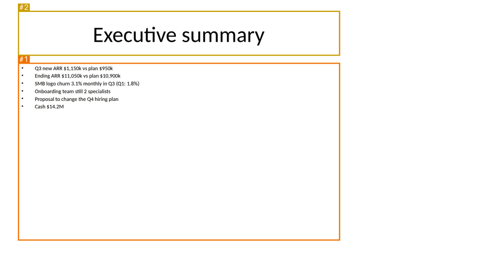

- **#1 [medium] font_below_floor**: Body text at 11 pt in "Content Placeholder 2" (floor 12 pt). Fix: Raise to 12 pt; if it no longer fits, cut words or split the slide.
- **#2 [low] title_not_claim**: Title "Executive summary" may be a topic label (common topic label). This is a heuristic guess; confirm it with the title-only read in the rubric. Fix: Rewrite as a claim: subject + verb + so-what, e.g. what changed, by how much, and why it matters.
- **So what:** Six facts and no message: a reader cannot tell that the board is being asked to approve anything. Story 2: label (0), facts without meaning (1), no source (0), one topic but cluttered (1).

### Slide 3: Bookings performance

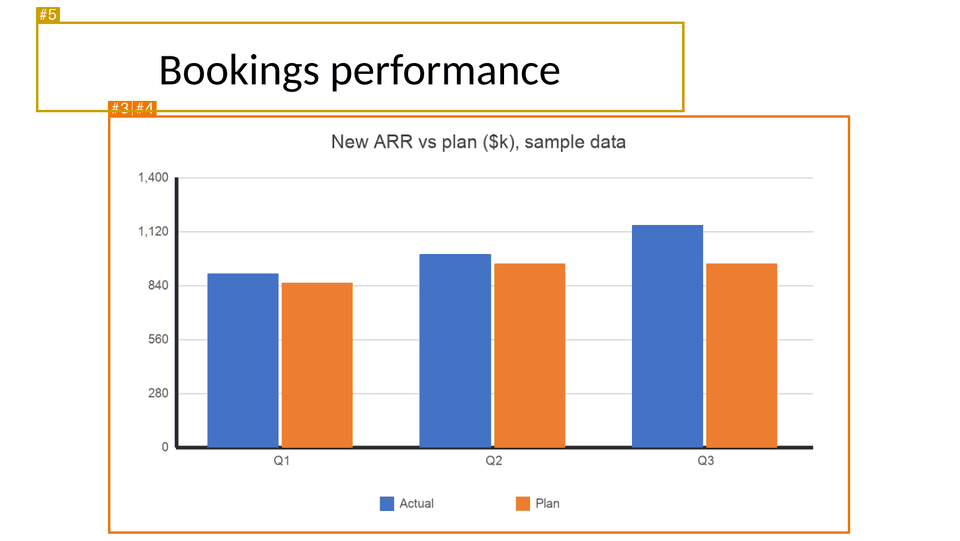

- **#3 [medium] missing_source**: Exhibit slide (picture) has no source line. Fix: Add 'Source: ...' under the exhibit (10 pt or more). If the numbers are not real, say 'Sample data'.
- **#4 [medium] chart_as_image**: "Picture 2" looks like a chart pasted as a picture (few flat colors (77), a light background (69%) and straight axis lines). Fix: Rebuild it as a native chart so the numbers stay editable and text stays sharp.
- **#5 [low] title_not_claim**: Title "Bookings performance" may be a topic label (2 words, no verb). This is a heuristic guess; confirm it with the title-only read in the rubric. Fix: Rewrite as a claim: subject + verb + so-what, e.g. what changed, by how much, and why it matters.
- **So what:** The chart shows actual above plan each quarter, but the title does not say so, the 21% Q3 beat is left for the reader to compute, and the chart is a picture with no source.

### Slide 4: Q3 ARR bridge

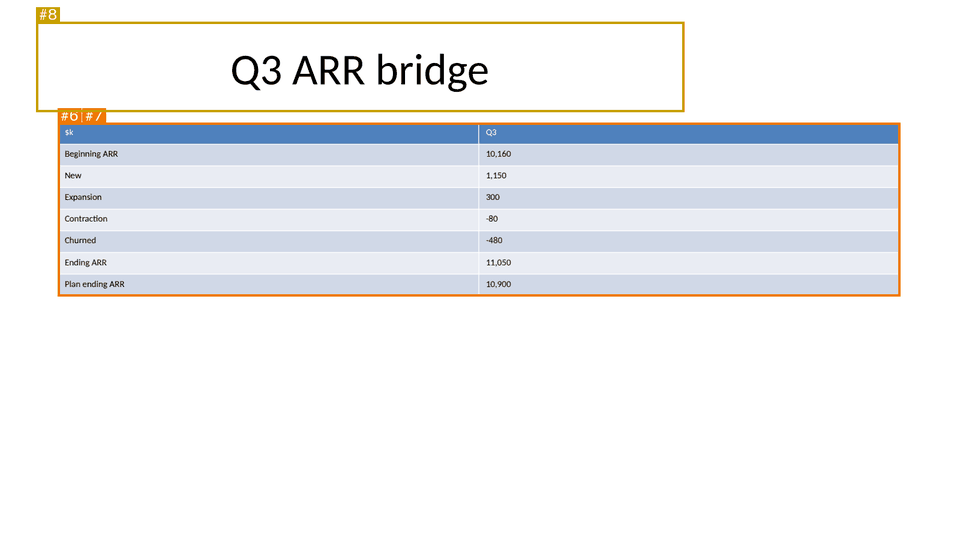

- **#6 [medium] font_below_floor**: Table text at 9 pt (floor 10 pt). Fix: Raise the table text size; drop columns or rows that do not support the title.
- **#7 [medium] missing_source**: Exhibit slide (table) has no source line. Fix: Add 'Source: ...' under the exhibit (10 pt or more). If the numbers are not real, say 'Sample data'.
- **#8 [low] title_not_claim**: Title "Q3 ARR bridge" may be a topic label (3 words, no verb). This is a heuristic guess; confirm it with the title-only read in the rubric. Fix: Rewrite as a claim: subject + verb + so-what, e.g. what changed, by how much, and why it matters.
- **So what:** The bridge is complete but the title does not say what it shows (churn ate a quarter of the beat). Table text at 9 pt, no source.

### Slide 5: Churn by segment

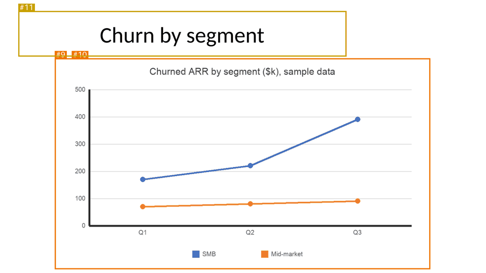

- **#9 [medium] missing_source**: Exhibit slide (picture) has no source line. Fix: Add 'Source: ...' under the exhibit (10 pt or more). If the numbers are not real, say 'Sample data'.
- **#10 [medium] chart_as_image**: "Picture 2" looks like a chart pasted as a picture (few flat colors (63), a light background (93%) and straight axis lines). Fix: Rebuild it as a native chart so the numbers stay editable and text stays sharp.
- **#11 [low] title_not_claim**: Title "Churn by segment" may be a topic label (3 words, no verb). This is a heuristic guess; confirm it with the title-only read in the rubric. Fix: Rewrite as a claim: subject + verb + so-what, e.g. what changed, by how much, and why it matters.
- **So what:** The line chart shows SMB churn rising steeply while mid-market is flat, the most important fact in the deck, but the title is a label and the chart is a picture.

### Slide 6: Q4 outlook

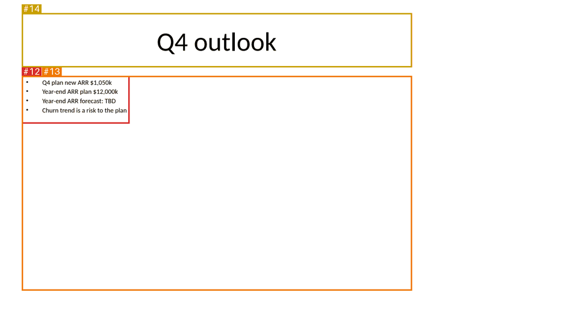

- **#12 [high] data_needed**: Unfinished content in "Content Placeholder 2": TBD. Fix: Fill in the real figure and its source, or cut the claim that needs it.
- **#13 [medium] font_below_floor**: Body text at 11 pt in "Content Placeholder 2" (floor 12 pt). Fix: Raise to 12 pt; if it no longer fits, cut words or split the slide.
- **#14 [low] title_not_claim**: Title "Q4 outlook" may be a topic label (2 words, no verb). This is a heuristic guess; confirm it with the title-only read in the rubric. Fix: Rewrite as a claim: subject + verb + so-what, e.g. what changed, by how much, and why it matters.
- **So what:** The slide that should size the problem says TBD. Nothing on it proves anything.

### Slide 7: Setup status of churned accounts

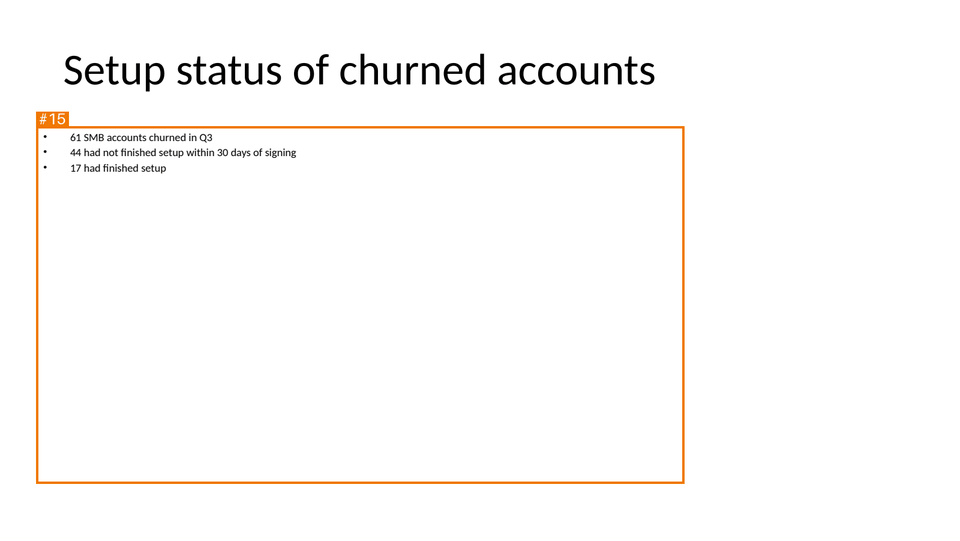

- **#15 [medium] font_below_floor**: Body text at 11 pt in "Content Placeholder 2" (floor 12 pt). Fix: Raise to 12 pt; if it no longer fits, cut words or split the slide.
- **So what:** 44 of 61 churned accounts never finished setup: a strong finding hidden under a label. The script did not flag this title (it has a noun phrase that reads like a sentence); the title-only read does.

### Slide 8: Churn by setup status

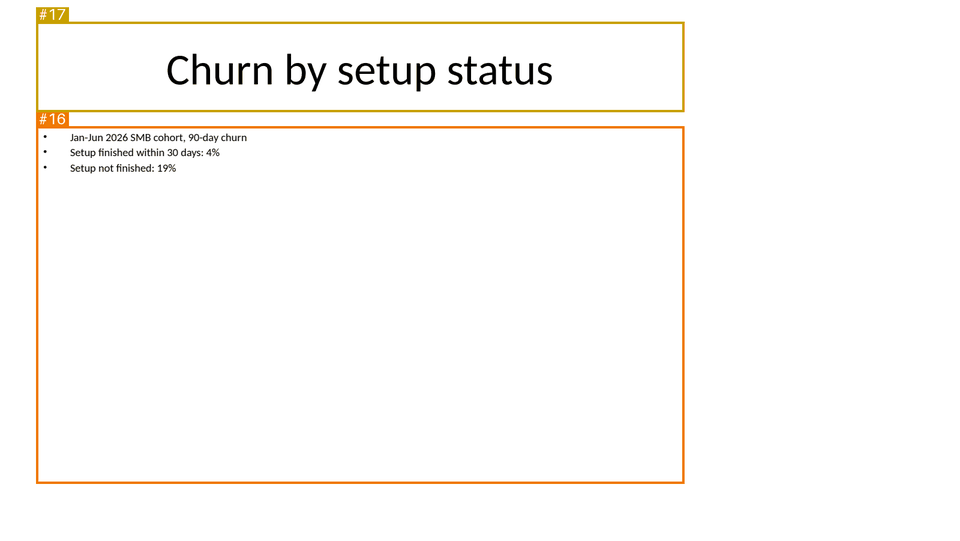

- **#16 [medium] font_below_floor**: Body text at 11 pt in "Content Placeholder 2" (floor 12 pt). Fix: Raise to 12 pt; if it no longer fits, cut words or split the slide.
- **#17 [low] title_not_claim**: Title "Churn by setup status" may be a topic label (no verb found; reads like a topic). This is a heuristic guess; confirm it with the title-only read in the rubric. Fix: Rewrite as a claim: subject + verb + so-what, e.g. what changed, by how much, and why it matters.
- **So what:** 4% against 19% is the mechanism behind the churn, but it is three bullets with no comparison stated.

### Slide 9: Onboarding capacity

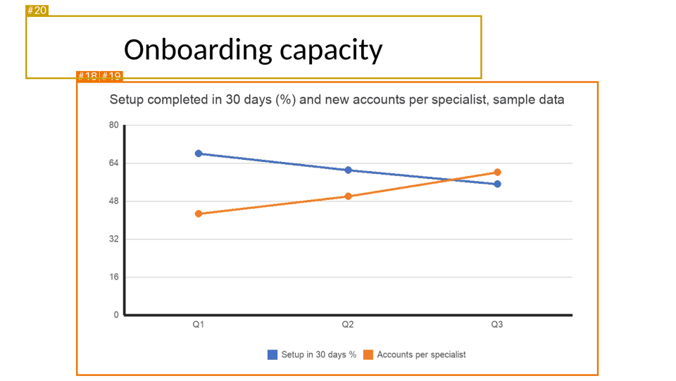

- **#18 [medium] missing_source**: Exhibit slide (picture) has no source line. Fix: Add 'Source: ...' under the exhibit (10 pt or more). If the numbers are not real, say 'Sample data'.
- **#19 [medium] chart_as_image**: "Picture 2" looks like a chart pasted as a picture (few flat colors (81), a light background (92%) and straight axis lines). Fix: Rebuild it as a native chart so the numbers stay editable and text stays sharp.
- **#20 [low] title_not_claim**: Title "Onboarding capacity" may be a topic label (2 words, no verb). This is a heuristic guess; confirm it with the title-only read in the rubric. Fix: Rewrite as a claim: subject + verb + so-what, e.g. what changed, by how much, and why it matters.
- **So what:** The chart mixes a percentage and a count on one axis and needs a legend to decode. The 41% rise in load is not on the slide.

### Slide 10: Proposal: hiring plan changes

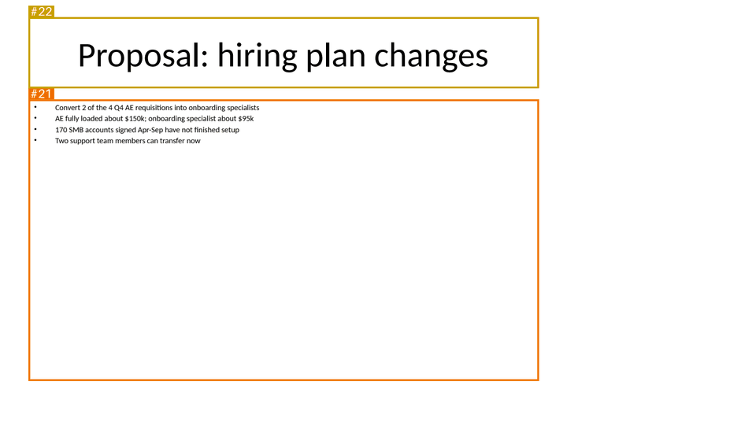

- **#21 [medium] font_below_floor**: Body text at 10 pt in "Content Placeholder 2" (floor 12 pt). Fix: Raise to 12 pt; if it no longer fits, cut words or split the slide.
- **#22 [low] title_not_claim**: Title "Proposal: hiring plan changes" may be a topic label (no verb found; reads like a topic). This is a heuristic guess; confirm it with the title-only read in the rubric. Fix: Rewrite as a claim: subject + verb + so-what, e.g. what changed, by how much, and why it matters.
- **So what:** The proposal, without its cost saving ($110k a year is computable from the bullets) or its effect on ARR.

### Slide 11: Risks

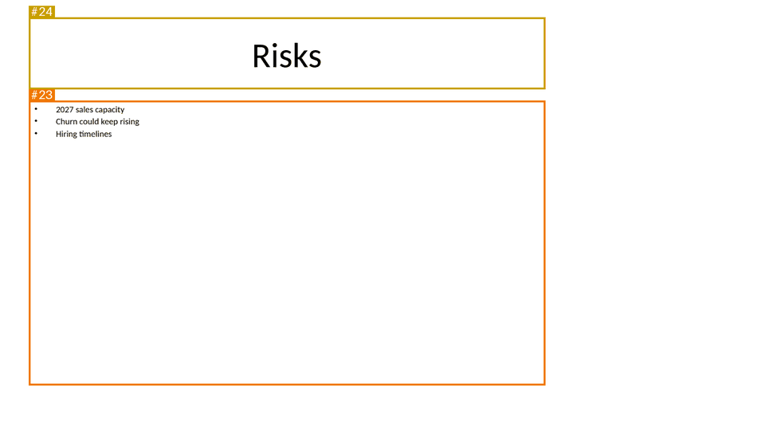

- **#23 [medium] font_below_floor**: Body text at 11 pt in "Content Placeholder 2" (floor 12 pt). Fix: Raise to 12 pt; if it no longer fits, cut words or split the slide.
- **#24 [low] title_not_claim**: Title "Risks" may be a topic label (common topic label). This is a heuristic guess; confirm it with the title-only read in the rubric. Fix: Rewrite as a claim: subject + verb + so-what, e.g. what changed, by how much, and why it matters.
- **So what:** Three nouns. No size, likelihood or owner for any risk.

### Slide 12: Next steps

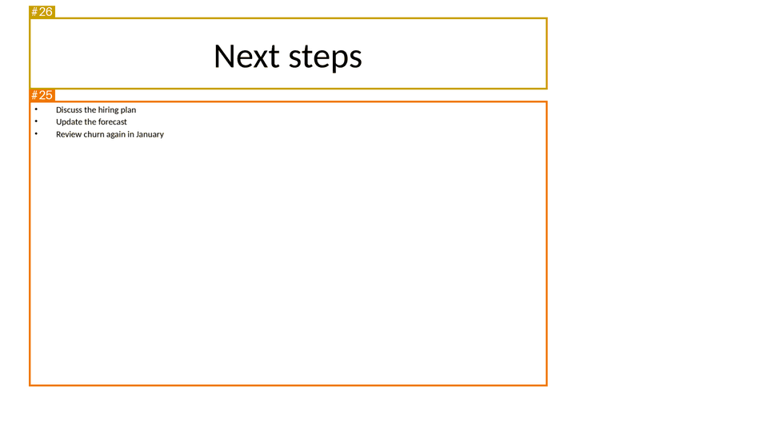

- **#25 [medium] font_below_floor**: Body text at 11 pt in "Content Placeholder 2" (floor 12 pt). Fix: Raise to 12 pt; if it no longer fits, cut words or split the slide.
- **#26 [low] title_not_claim**: Title "Next steps" may be a topic label (common topic label). This is a heuristic guess; confirm it with the title-only read in the rubric. Fix: Rewrite as a claim: subject + verb + so-what, e.g. what changed, by how much, and why it matters.
- **So what:** "Discuss", "update", "review": no decision, owner or date. The board leaves without the two approvals the CEO needs.

### Slide 13: Cash runway

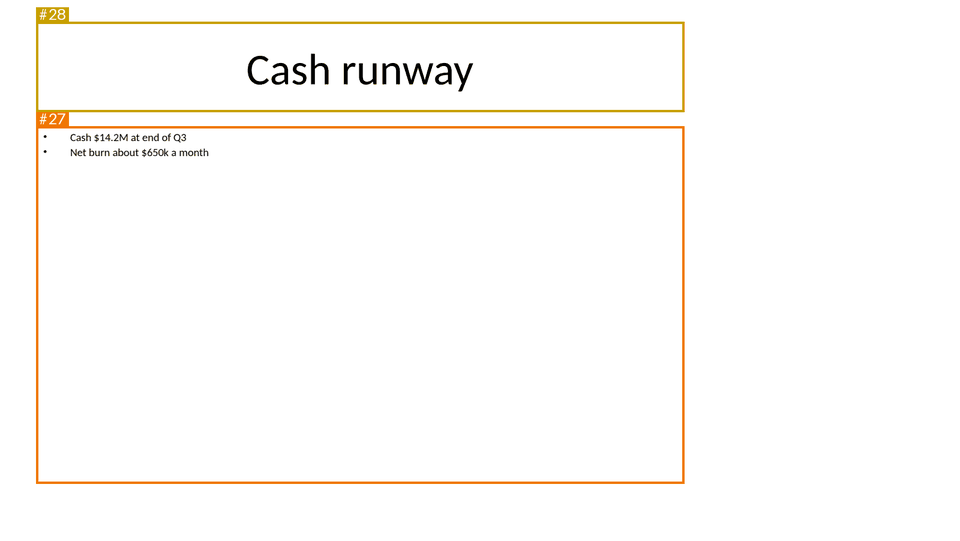

- **#27 [medium] font_below_floor**: Body text at 11 pt in "Content Placeholder 2" (floor 12 pt). Fix: Raise to 12 pt; if it no longer fits, cut words or split the slide.
- **#28 [low] title_not_claim**: Title "Cash runway" may be a topic label (2 words, no verb). This is a heuristic guess; confirm it with the title-only read in the rubric. Fix: Rewrite as a claim: subject + verb + so-what, e.g. what changed, by how much, and why it matters.
- **So what:** Cash and burn are given, the runway they imply is not.

### Slide 14: Q1-Q3 2026 metrics by quarter

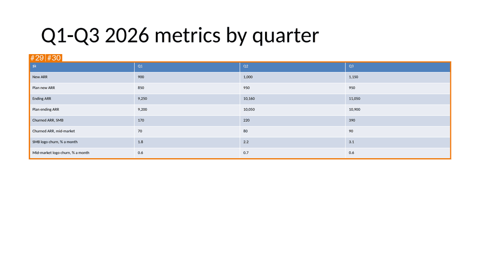

- **#29 [medium] font_below_floor**: Table text at 8 pt (floor 10 pt). Fix: Raise the table text size; drop columns or rows that do not support the title.
- **#30 [medium] missing_source**: Exhibit slide (table) has no source line. Fix: Add 'Source: ...' under the exhibit (10 pt or more). If the numbers are not real, say 'Sample data'.
- **So what:** Appendix table; a label title is fine here. 8 pt text and no source.

## Automatic fixes

`before-review/before.fixed.pptx` changes layout and size only. Words, numbers, chart data and slide order are unchanged. Any `[SOURCE NEEDED]` line it adds must be replaced with the real source.

| Slide | Shape | Check | Change |
|---|---|---|---|
| 2 | Content Placeholder 2 | font_below_floor | raised 6 text run(s) to the 12 pt floor |
| 3 | Picture 2 | missing_source | added a 'Source: [SOURCE NEEDED]' line under the exhibit |
| 4 | Table 2 | font_below_floor | raised 16 text run(s) to the 10 pt floor |
| 4 | Table 2 | missing_source | added a 'Source: [SOURCE NEEDED]' line under the exhibit |
| 5 | Picture 2 | missing_source | added a 'Source: [SOURCE NEEDED]' line under the exhibit |
| 6 | Content Placeholder 2 | font_below_floor | raised 4 text run(s) to the 12 pt floor |
| 7 | Content Placeholder 2 | font_below_floor | raised 3 text run(s) to the 12 pt floor |
| 8 | Content Placeholder 2 | font_below_floor | raised 3 text run(s) to the 12 pt floor |
| 9 | Picture 2 | missing_source | added a 'Source: [SOURCE NEEDED]' line under the exhibit |
| 10 | Content Placeholder 2 | font_below_floor | raised 4 text run(s) to the 12 pt floor |
| 11 | Content Placeholder 2 | font_below_floor | raised 3 text run(s) to the 12 pt floor |
| 12 | Content Placeholder 2 | font_below_floor | raised 3 text run(s) to the 12 pt floor |
| 13 | Content Placeholder 2 | font_below_floor | raised 2 text run(s) to the 12 pt floor |
| 14 | Table 2 | font_below_floor | raised 36 text run(s) to the 10 pt floor |
| 14 | Table 2 | missing_source | added a 'Source: [SOURCE NEEDED]' line under the exhibit |

Left in the fixed copy (need a person): title_not_claim ×11, data_needed ×6, chart_as_image ×3, overlap ×3.

## Rubric review

Audience and purpose (from `brief.md`): the board of a fictional SaaS company; the CEO needs two approvals (move two Q4 sales hires to onboarding, accept a revised year-end ARR forecast).

**Title read-through (pass 1).** The titles read as an agenda: *Q3 2026 board update. Executive summary. Bookings performance. Q3 ARR bridge. Churn by segment. Q4 outlook. Setup status of churned accounts. Churn by setup status. Onboarding capacity. Proposal: hiring plan changes. Risks. Next steps. Cash runway. Q1-Q3 2026 metrics by quarter.* Governing message heard: none.

| # | Question | Result | Why |
|---|---|---|---|
| 1 | Governing message from the titles alone | Fail | The titles name topics; nothing says Q3 beat plan, churn threatens the year, or what to approve |
| 2 | Every content title a full-sentence claim | Fail | 12 of 12 content titles are labels (the script flagged 11; slide 7 is a label too) |
| 3 | Each title follows from the one before | Fail | Without claims there is no chain; "Proposal" appears before the reader knows the problem's size |
| 4 | Each key argument appears in order | Fail | Results, constraint, cause and fix are all in the deck, but only as topics |
| 5 | Nothing said twice | Pass | No duplicated topics |
| 6 | Ends on what the reader must decide | Fail | "Next steps" asks the board to discuss, not decide |
| 7 | Every number in a title is backed on its slide | Pass (trivially) | The titles contain no numbers |

**Across slides (pass 3).** Duplication: none. Gaps: no slide sizes the gap to plan (slide 6 says TBD), no slide gives the cost or benefit of the proposal, no slide states the two decisions. Order: the answer is never stated, so the deck builds to "Next steps".

**Evidence (pass 4).** The numbers are all in the deck's own sample data, so nothing is invented, but none has a source line, and three charts are pictures whose data cannot be checked or edited. The one forecast the board needs is missing (TBD).

**[DATA NEEDED] and placeholders found:** "Year-end ARR forecast: TBD" (slide 6). The rewritten titles for slides 6, 11 and 12 mark the numbers they would need as `[DATA NEEDED]` rather than guessing them.

**Mechanical vs story.** Mechanical score 7.5/10; story score mean 2.8 over slides 2-14. The deck is readable enough on screen; it fails because it does not argue.

**Verdict:** needs a storyline rework. The rework is the next step in this example: `storyline.md` (deck-storyline) gives the argument and the missing projection with its assumptions, and `deck.json` builds it as `deck.pptx`. Its review is `after-review.md`: 0 high, 0 medium.
